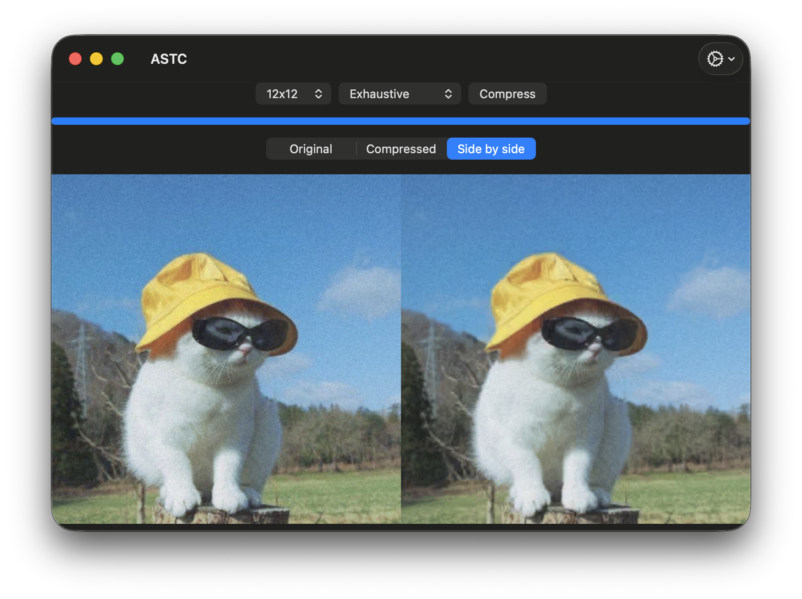

# ASTCEncoder
ARM's [astc-encoder](https://github.com/ARM-software/astc-encoder) library prebuilt for all Apple platforms and Android with C++ helper interfaces and Swift support.

Current version: [5.6.0](https://github.com/ARM-software/astc-encoder/releases/tag/5.6.0).


_An example of compressing a 384x384 image (original on the left) using the biggest (12x12) block size with the highest quality - 432KB vs 16KB_

## Installing ASTCEncoder

Add the following dependency to your Package.swift:

```Swift
.package(url: "https://github.com/EvgenijLutz/ASTCEncoder.git", from: "5.6.0")
```


Original astcenc API in C/C++
```Swift
// Add a dependency to your target
.product(name: "astcenc", package: "ASTCEncoder")

// And then include the `astcenc.h` header
#include <astcenc.h>
```


Original astcenc API with additional helpers in C++
```Swift
// Add a dependency to your target
.product(name: "ASTCEncoderC", package: "ASTCEncoder")

// And then include the `ASTCEncoderC.hpp` header
#include <ASTCEncoderC/ASTCEncoderC.hpp>
```


Swift API
```Swift
// Add a dependency to your target
.product(name: "ASTCEncoder", package: "ASTCEncoder")

// And then import the module in your target
import ASTCEncoder
```

Voilà, you're good to go!
